# HSVJEngine 模块关系图文档

> 最后更新：2024年
> 版本：1.0

## 目录

- [1. 模块依赖关系图](#1-模块依赖关系图)
- [2. 数据流图](#2-数据流图)
- [3. 调用关系图](#3-调用关系图)
- [4. 模块交互时序图](#4-模块交互时序图)
- [5. 模块耦合度分析](#5-模块耦合度分析)

---

## 1. 模块依赖关系图

### 1.1 整体依赖关系

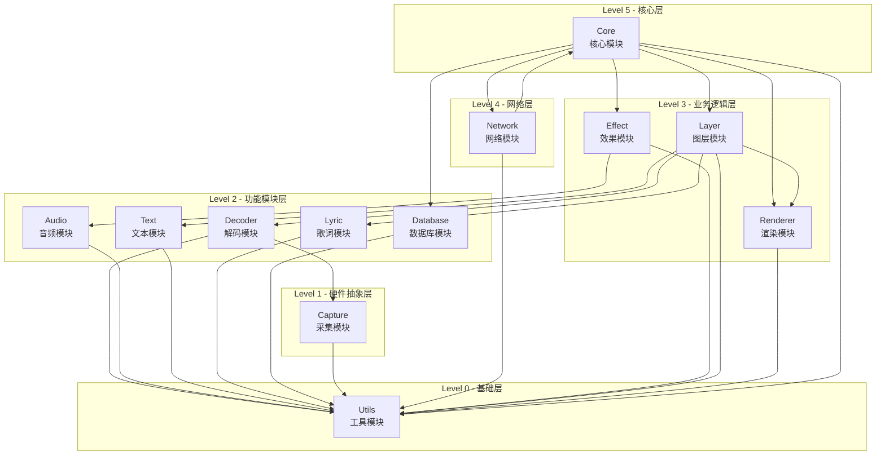

### 1.2 模块依赖矩阵

| 模块 | Core | Layer | Decoder | Renderer | Audio | Effect | Network | Database | Text | Lyric | Capture | Utils |
|------|------|-------|---------|----------|-------|--------|---------|----------|------|-------|---------|-------|
| **Core** | - | ✓ | - | ✓ | - | ✓ | ✓ | ✓ | - | - | - | - | ✓ |
| **Layer** | - | - | ✓ | ✓ | - | - | - | - | ✓ | ✓ | - | - | ✓ |
| **Decoder** | - | - | - | - | - | - | - | - | - | - | ✓ | - | ✓ |
| **Renderer** | - | - | - | - | - | - | - | - | - | - | - | ✓ | ✓ |
| **Audio** | - | - | - | - | - | - | - | - | - | - | - | - | ✓ |
| **Effect** | - | - | - | - | ✓ | - | - | - | - | - | - | - | ✓ |
| **Network** | ✓ | - | - | - | - | - | - | - | - | - | - | - | ✓ |
| **Database** | - | - | - | - | - | - | - | - | - | - | - | - | ✓ |
| **Text** | - | - | - | - | - | - | - | - | - | - | - | - | ✓ |
| **Lyric** | - | - | - | - | - | - | - | - | - | - | - | - | ✓ |
| **Capture** | - | - | - | - | - | - | - | - | - | - | - | - | ✓ |
| **Utils** | - | - | - | - | - | - | - | - | - | - | - | - | - |

**说明**：
- ✓ 表示行模块依赖列模块
- `-` 表示无依赖关系

### 1.3 核心模块详细依赖

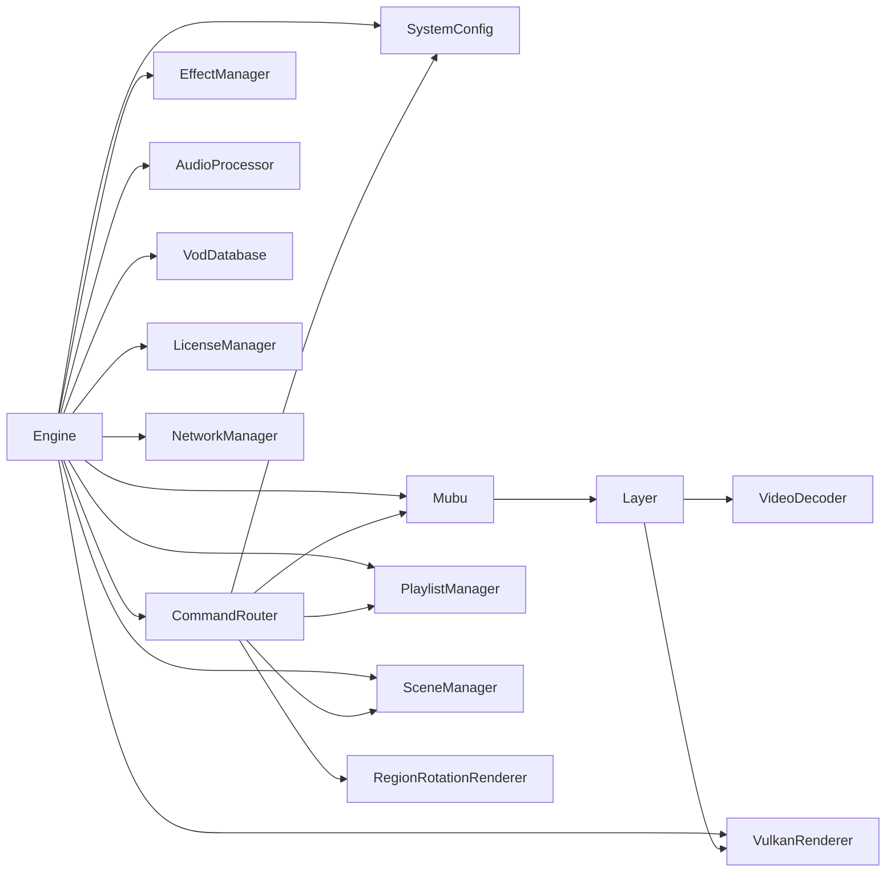

---

## 2. 数据流图

### 2.1 视频播放数据流

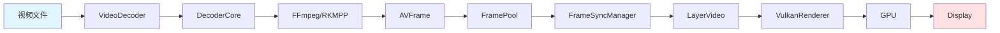

### 2.2 音频处理数据流

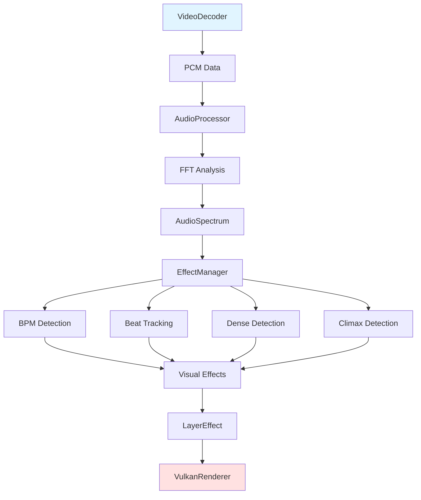

### 2.3 网络控制数据流

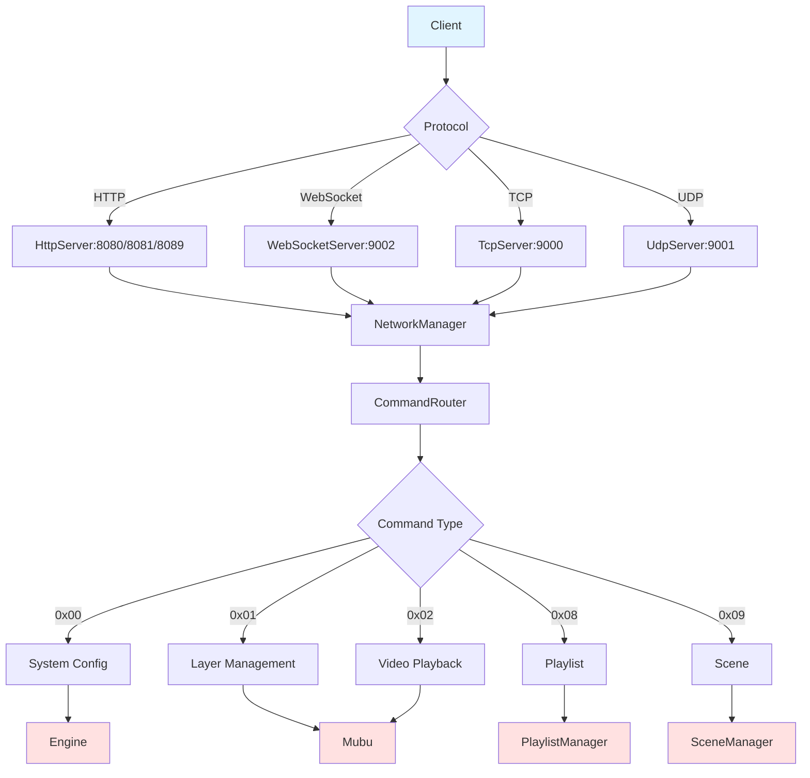

### 2.4 渲染管线数据流

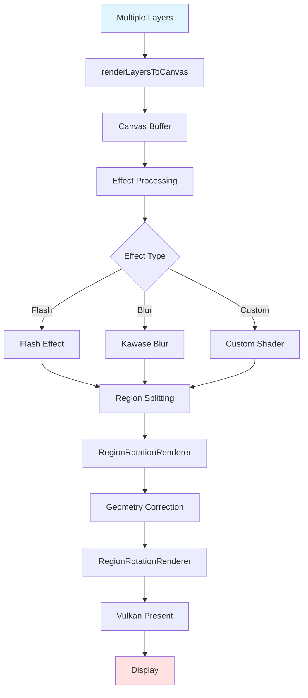

---

## 3. 调用关系图

### 3.1 Engine初始化调用链

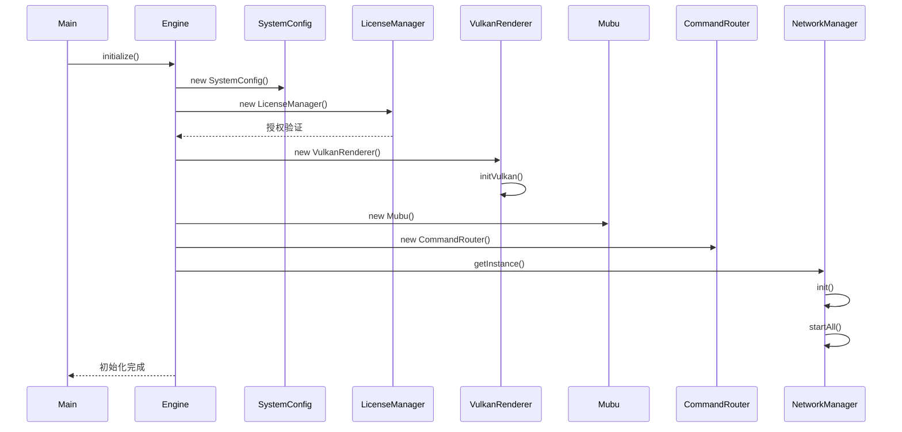

### 3.2 视频播放调用链

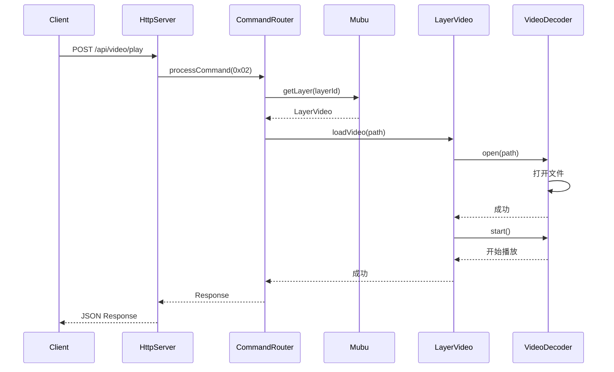

### 3.3 音频效果联动调用链

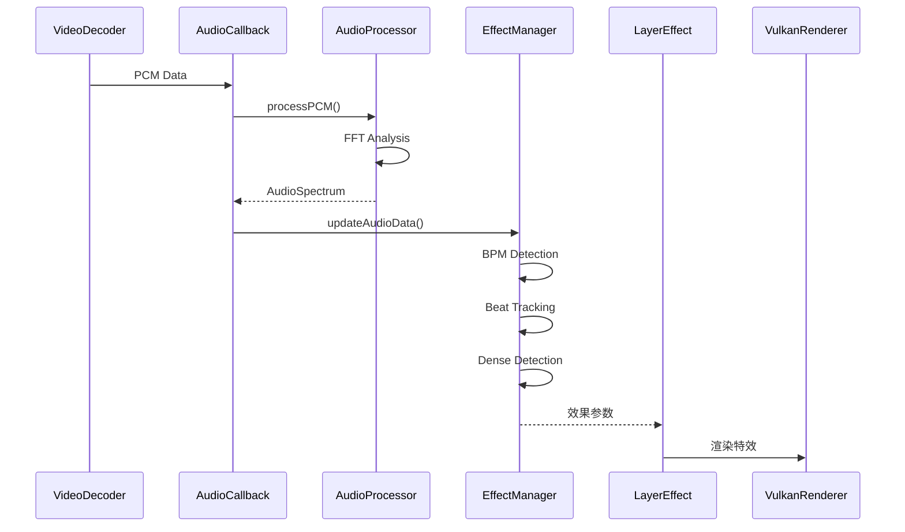


---

## 4. 模块交互时序图

### 4.1 场景切换时序

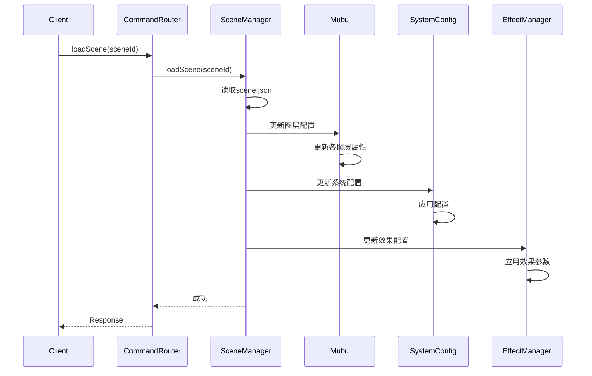

### 4.2 播放列表自动播放时序

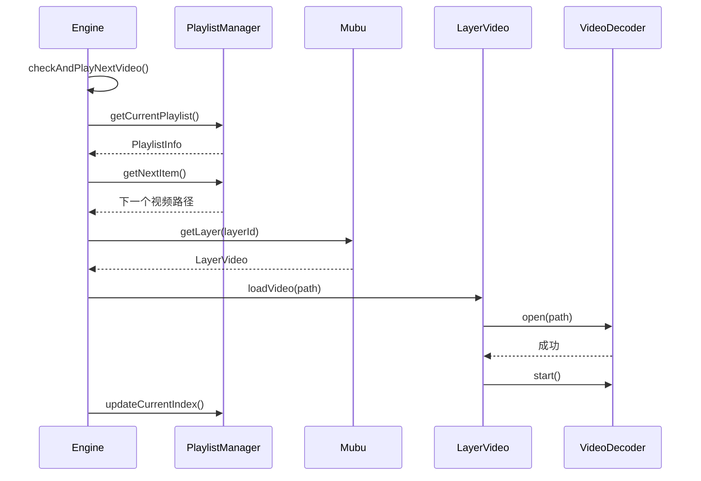

### 4.3 多图层渲染时序

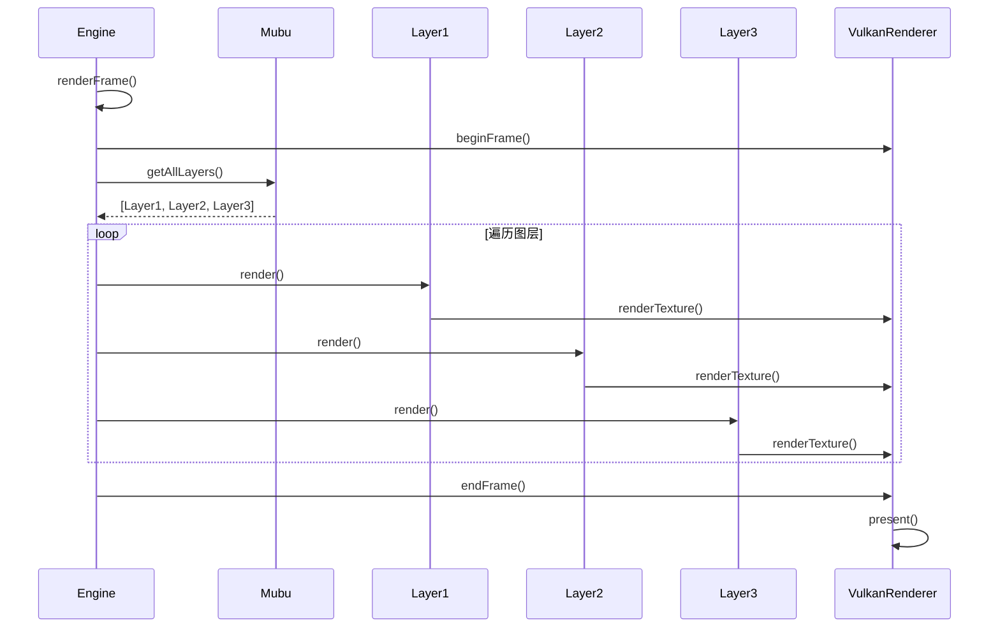

### 4.4 网络命令处理时序

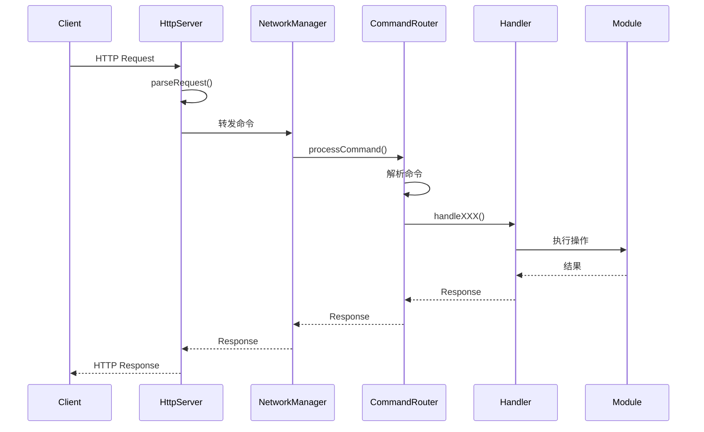

---

## 5. 模块耦合度分析

### 5.1 耦合度评分

| 模块 | 入度 | 出度 | 总耦合度 | 耦合等级 |
|------|------|------|----------|----------|
| **Utils** | 11 | 0 | 11 | 低 |
| **Core** | 1 | 7 | 8 | 高 |
| **Layer** | 1 | 5 | 6 | 中 |
| **Renderer** | 2 | 1 | 3 | 低 |
| **Network** | 1 | 2 | 3 | 低 |
| **Decoder** | 1 | 2 | 3 | 低 |
| **Effect** | 1 | 2 | 3 | 低 |
| **Database** | 1 | 1 | 2 | 低 |
| **Audio** | 1 | 1 | 2 | 低 |
| **Text** | 1 | 1 | 2 | 低 |
| **Lyric** | 1 | 1 | 2 | 低 |
| **Capture** | 1 | 1 | 2 | 低 |

**说明**：
- **入度**：有多少模块依赖该模块
- **出度**：该模块依赖多少其他模块
- **总耦合度** = 入度 + 出度

### 5.2 耦合度可视化

```
高耦合 (>6):  Core ████████
中耦合 (4-6): Layer ██████, Renderer ████
低耦合 (<4):  其他模块 ██
```

### 5.3 模块独立性分析

#### 高独立性模块（可独立测试和开发）
- **Utils**：纯工具模块，无依赖
- **Capture**：仅依赖Utils
- **Database**：仅依赖Utils
- **Audio**：仅依赖Utils
- **Text**：仅依赖Utils
- **Lyric**：仅依赖Utils

#### 中独立性模块（需要少量依赖）
- **Decoder**：依赖Capture和Utils
- **Effect**：依赖Audio和Utils
- **Renderer**：依赖Utils

#### 低独立性模块（高度集成）
- **Layer**：依赖Decoder、Text、Lyric、Renderer、Utils
- **Network**：依赖Core和Utils
- **Core**：依赖几乎所有模块

### 5.4 循环依赖检测

**检测结果**：✅ 无循环依赖

**说明**：
- Core和Network之间存在双向调用，但通过接口解耦
- Network通过CommandRouter调用Core的功能
- Core通过NetworkManager管理Network的生命周期
- 使用依赖注入避免循环依赖

### 5.5 模块内聚度分析

| 模块 | 内聚类型 | 内聚度 | 说明 |
|------|----------|--------|------|
| **Core** | 功能内聚 | 高 | 核心功能集中 |
| **Layer** | 功能内聚 | 高 | 图层管理集中 |
| **Decoder** | 功能内聚 | 高 | 解码功能集中 |
| **Renderer** | 功能内聚 | 高 | 渲染功能集中 |
| **Audio** | 功能内聚 | 高 | 音频处理集中 |
| **Effect** | 功能内聚 | 高 | 效果分析集中 |
| **Network** | 功能内聚 | 中 | 多协议混合 |
| **Database** | 功能内聚 | 高 | 数据库操作集中 |
| **Text** | 功能内聚 | 中 | 多种渲染器 |
| **Lyric** | 功能内聚 | 高 | 歌词功能集中 |
| **Capture** | 功能内聚 | 高 | 采集功能集中 |
| **Utils** | 工具内聚 | 中 | 工具函数集合 |

---

## 6. 模块通信方式

### 6.1 通信方式分类

| 通信方式 | 使用场景 | 示例 |
|----------|----------|------|
| **直接调用** | 同步操作 | Engine → Mubu |
| **回调函数** | 异步通知 | VideoDecoder → AudioCallback |
| **事件通知** | 松耦合通信 | WebSocket事件 |
| **消息队列** | 跨线程通信 | 解码线程 → 渲染线程 |
| **共享内存** | 高性能数据传递 | 零拷贝帧传递 |

### 6.2 线程模型

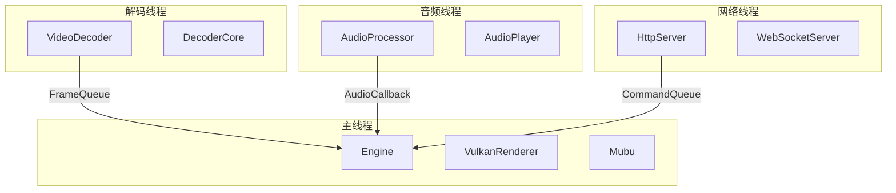

### 6.3 数据同步机制

**互斥锁（Mutex）**：
- 图层列表访问
- 配置文件读写
- 播放列表操作

**原子操作（Atomic）**：
- 峰值标志
- 播放状态
- 帧计数器

**条件变量（Condition Variable）**：
- 帧队列同步
- 解码线程控制

**读写锁（RWLock）**：
- 场景配置读取
- 系统配置访问

---

## 7. 模块扩展点

### 7.1 可扩展模块

| 模块 | 扩展点 | 扩展方式 |
|------|--------|----------|
| **Layer** | 新图层类型 | 继承Layer基类 |
| **Renderer** | 自定义特效 | 添加着色器 |
| **Effect** | 新检测算法 | 实现检测器接口 |
| **Network** | 新协议 | 实现Server接口 |
| **Text** | 新渲染器 | 实现TextRenderer接口 |
| **CommandRouter** | 新命令 | 注册Handler |

### 7.2 插件化设计

**支持的插件类型**：
- 特效插件（Shader）
- 检测器插件（Detector）
- 渲染器插件（Renderer）
- 协议插件（Protocol）

**插件接口**：
```cpp
class IPlugin {
public:
    virtual bool initialize() = 0;
    virtual void shutdown() = 0;
    virtual std::string getName() const = 0;
    virtual std::string getVersion() const = 0;
};
```

---

## 8. 总结

### 8.1 架构优点

1. **清晰的分层**：5层架构，职责明确
2. **低耦合**：大部分模块耦合度低
3. **高内聚**：模块功能集中
4. **无循环依赖**：依赖关系单向
5. **易于扩展**：多个扩展点

### 8.2 改进建议

1. **Network模块**：可以进一步拆分协议
2. **Text模块**：统一渲染器接口
3. **Utils模块**：按功能细分子模块
4. **Core模块**：考虑拆分CommandRouter

### 8.3 模块关系总结

HSVJEngine的模块关系设计合理，依赖关系清晰，耦合度适中。Core模块作为核心协调者，其他模块各司其职。通过接口和依赖注入实现了良好的解耦，便于测试和维护。
