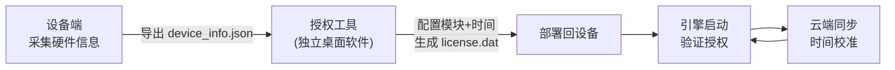

# HSVJEngine 授权管理系统 — 实施方案

## 整体流程



> **两个独立系统**：
> 1. **设备端**（HSVJEngine）— 采集硬件信息、导出设备信息文件、运行时验证授权
> 2. **授权工具**（独立桌面软件）— 导入设备信息、配置授权参数、签发授权文件

---

## Part A：设备端（HSVJEngine）

### A1. 硬件信息采集 — SystemUtils

**文件**: `src/utils/SystemUtils.h` / `SystemUtils.cpp`

| 方法 | Android 实现 | 非 Android |
|---|---|---|
| `getHardwareModel()` | `__system_property_get("ro.product.model")` | `"DESKTOP"` |
| `getHardwareSerial()` | `__system_property_get("ro.serialno")` | `"DEV-SERIAL"` |
| `getCpuSerial()` | 解析 `/proc/cpuinfo` → `Serial` 行 | `"DEV-CPU"` |
| `getStorageSerial()` | `/sys/block/mmcblk0/device/serial` | `"DEV-EMMC"` |
| `getMacAddress()` | `/sys/class/net/eth0/address`，fallback `wlan0` | `"00:00:00:00:00:00"` |
| `generateDeviceFingerprint()` | 基于 model+serial+cpu+storage 的稳定哈希 | 同逻辑 |

### A2. 设备信息 API

**文件**: `src/network/HttpServer_System.cpp`

#### `GET /api/system/device-info`

前端页面调用，返回设备硬件信息：

```json
{
  "code": 0,
  "result": {
    "model": "RK3568",
    "serial": "XXXX",
    "cpu_serial": "XXXX",
    "storage_serial": "XXXX",
    "mac": "AA:BB:CC:DD:EE:FF",
    "fingerprint": "a1b2c3d4e5...",
    "ip": "192.168.1.100"
  },
  "message": "获取设备信息成功"
}
```

#### `POST /api/system/device-info/export`

将设备信息导出为 `device_info.json` 文件，保存到 `{ROOT_PATH}/config/`：

```json
{
  "version": 1,
  "export_time": 1707753600,
  "device": {
    "model": "RK3568",
    "serial": "XXXX",
    "cpu_serial": "XXXX",
    "storage_serial": "XXXX",
    "mac": "AA:BB:CC:DD:EE:FF",
    "fingerprint": "a1b2c3d4e5..."
  }
}
```

### A3. 授权验证 — LicenseManager

**文件**: `src/core/LicenseManager.h` / `LicenseManager.cpp`

#### 核心常量

```cpp
static constexpr int DAYS_BEFORE_WARNING = 15;    // 剩余 15 天开始提示
static constexpr int DAYS_EXPIRED_PERMANENT = 15;  // 过期 15 天后黑屏
static constexpr float WARNING_DURATION = 300.0f;  // 启动提示时长：5 分钟
static constexpr float WARNING_SAVE_PERIOD = 300.0f; // 状态保存周期：5 分钟
static constexpr int CLOUD_SYNC_INTERVAL = 1800;   // 云端校准周期：30 分钟
static constexpr const char* DEFAULT_CLOUD_HOST = "60.205.127.117";
static constexpr int DEFAULT_CLOUD_PORT = 8080;
```

#### 警告策略

| 阶段 | 条件 | 行为 |
|------|------|------|
| `NONE` | 剩余天数 > 15 | 无提示 |
| `BEFORE_EXPIRY` | 0 < 剩余天数 ≤ 15 | 启动后显示水印 5 分钟 |
| `EXPIRED_1_15` | -15 ≤ 剩余天数 ≤ 0 | 永久显示居中水印 |
| `EXPIRED_15_PLUS` | 剩余天数 < -15 | 永久水印 + **黑屏阻止播放** |
| `UNLICENSED` | 未授权或文件无效 | 永久水印 + **黑屏阻止播放** |

#### 核心方法

| 方法 | 说明 |
|---|---|
| `checkLicense()` | 解析 JSON → 校验签名 → 比对设备指纹 → 启动云端同步 |
| `update(deltaTime)` | 每帧调用，更新剩余天数、告警状态、定时保存 |
| `isModuleEnabled(string)` | 检查指定模块是否已授权 |
| `isLayerEnabled(int)` | 检查指定图层是否已授权 |
| `reloadLicense()` | 重新从文件加载授权 |
| `triggerCloudSync()` | 触发云端即时同步 |
| `applyBrowserTimeHint(int64)` | 使用网页端时间辅助校正（仅允许减少天数） |

### A4. 授权状态 API

#### `GET /api/system/license`

返回当前授权状态：

```json
{
  "code": 0,
  "result": {
    "status": "valid",
    "customer_name": "XXX KTV",
    "usage_mode": "rent",
    "expiry_date": "2025-03-10",
    "days_remaining": 25,
    "arrears_amount": 0,
    "modules": ["ktv", "vod"],
    "enabled_layers": [1, 2, 5, 10, 20, 41],
    "days_source": "cloud"
  },
  "message": "获取授权状态成功"
}
```

#### `POST /api/system/license/import`

导入授权文件（multipart/form-data，字段名 `license`），保存后自动重新加载授权。

### A5. 云端同步机制

**文件**: `src/network/CloudLicenseClient.cpp`

- 启动时自动连接云端服务器（`60.205.127.117:8080`）
- 每 30 分钟校准一次授权时间和剩余天数
- 云端返回的剩余天数是最高优先级
- 支持离线状态保存，恢复后自动同步

---

## Part B：授权工具（独立桌面软件）

> [!IMPORTANT]
> 此为独立的 Windows/Linux 桌面程序，不在 HSVJEngine 中运行。用于管理员签发授权文件。

### B1. 功能

1. **导入** `device_info.json` — 读取设备指纹
2. **配置授权参数**：
   - 客户信息（名称、地址、联系方式）
   - 授权模块勾选：☐ KTV ☐ VOD ☐ 特效
   - 图层选择：勾选需要启用的图层 ID
   - 商业模式：买断 / 租赁 / 分期
   - 有效期：开始时间 → 结束时间
   - 欠费金额 / 付款二维码（分期模式）
3. **生成** `license.dat` — 对授权内容 HMAC-SHA256 签名，输出加密授权文件
4. **部署** — 将 `license.dat` 拷贝到设备的 `{ROOT_PATH}/license/` 目录

### B2. 授权文件格式（license.dat）

```json
{
  "version": 2,
  "customer": {
    "name": "XXX KTV",
    "address": "XX路XX号",
    "contact": "138XXXX"
  },
  "license": {
    "modules": ["ktv", "vod"],
    "enabled_layers": [1, 2, 5, 10, 20, 41],
    "usage_mode": "rent",
    "arrears_amount": 0,
    "payment_qr_url": ""
  },
  "device": {
    "fingerprint": "a1b2c3d4e5..."
  },
  "validity": {
    "issue_time": 1707753600,
    "expiry_time": 1710432000
  },
  "signature": "hmac-sha256-hex-string"
}
```

### B3. 技术选型建议

| 方案 | 优点 | 缺点 |
|---|---|---|
| **Qt (C++)** | 与引擎共享签名代码 | 体积较大 |
| **Electron + Node.js** | 开发快、跨平台 | 包较大 |
| **Python + PyQt/Tkinter** | 最轻量、开发最快 | 需打包为 exe |

---

## 实施顺序

| 阶段 | 内容 | 涉及文件 | 依赖 |
|---|---|---|---|
| ① | SystemUtils 硬件采集 | `SystemUtils.h/cpp` | 无 |
| ② | LicenseManager 数据结构+验证 | `LicenseManager.h/cpp` | ① |
| ③ | 设备信息 + 授权状态 API | `HttpServer_System.cpp` | ①② |
| ④ | 前端授权管理页 | 调试页面 JS/CSS | ③ |
| ⑤ | 独立授权工具 | 独立项目 | ①② 的签名算法 |

---

## 安全设计

| 要点 | 实现方式 |
|---|---|
| 授权文件防篡改 | HMAC-SHA256 签名，内嵌实现不依赖 OpenSSL，避免 Android -fPIC 链接问题 |
| 设备绑定 | 多因子指纹哈希（model+serial+cpu+storage），防止拷贝授权文件到其他设备 |
| 时间防回拨 | 记录最后校验时间戳，检测系统时间倒退；云端时间校准优先级最高 |
| 旧版兼容 | 自动检测 JSON v2 或旧版格式 |
| Base64 支持 | license.dat 可为原始 JSON 或 Base64 编码格式 |

---

## 关键文件位置

| 功能 | 文件 |
|------|------|
| **授权管理器** | `src/core/LicenseManager.cpp` |
| **签名验证** | `src/core/LicenseVerify.cpp` - 内嵌 HMAC-SHA256 实现 |
| **云端同步** | `src/network/CloudLicenseClient.cpp` |
| **系统工具** | `src/utils/SystemUtils.cpp` - 硬件信息采集 |
| **API 路由** | `src/network/HttpServer_System.cpp` |
| **常量定义** | `include/core/LicenseManager.h` |

---

**文档版本**: 2.0
**更新日期**: 2026-05-30
