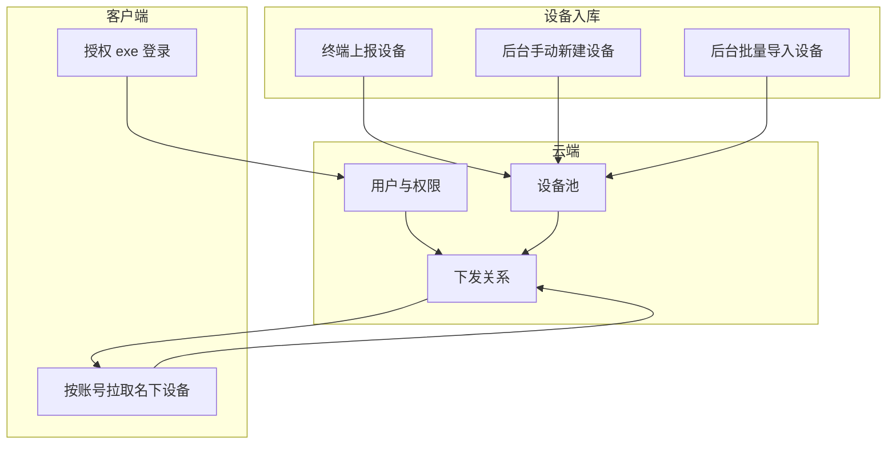

# 云端用户与设备管理系统 — 设计方案

本文档描述与授权工具配套的**云端后台**：用户管理、设备管理、终端上报设备、设备下发至代理商、以及授权客户端所需接口。实现后可支撑「终端/后台录入设备 → 下发到代理商 → 授权 exe 登录后拉取名下设备」的完整流程。

---

## 1. 系统概览



- **设备入库**：终端通过接口上报、后台手动新建、后台批量导入。
- **设备池**：所有已录入设备，未下发前处于「未归属」状态。
- **用户与权限**：管理员、代理商；代理商仅能查看/操作名下设备。
- **下发**：将设备池中的设备分配到指定代理商账号名下。
- **授权客户端**：登录后仅能拉取「已下发到自己名下」的设备列表（序列号等信息），用于生成授权文件。

---

## 2. 角色与权限

| 角色     | 说明                     | 主要能力 |
|----------|--------------------------|----------|
| 管理员   | 平台运营/运维            | 用户管理、设备池管理、下发、查看全部数据 |
| 代理商   | 使用授权 exe 签发 license | 登录、仅查看/拉取自己名下的设备列表 |

- 终端上报接口：可设计为「匿名上报」或「带密钥/SN 校验」上报，仅写入设备池，不依赖用户登录。
- 管理员操作：需管理员登录后使用（后台管理端或管理 API）。
- 代理商：仅能调用 [云端认证与授权接口设计](云端认证与授权接口设计.md) 中的登录、获取名下设备等接口。

---

## 3. 数据模型（建议）

### 3.1 用户（代理商账号）

| 字段         | 类型   | 说明 |
|--------------|--------|------|
| id           | string | 主键 |
| username     | string | 登录名，唯一 |
| password_hash| string | 密码哈希（如 bcrypt） |
| name         | string | 代理商名称/显示名 |
| contact      | string | 联系方式，可选 |
| status       | string | 启用/禁用 |
| created_at   | int64  | 创建时间 |
| updated_at   | int64  | 更新时间 |

管理员可单独建表或与代理商同表，通过 `role` 区分（如 admin / agent）。

### 3.2 设备

| 字段          | 类型   | 说明 |
|---------------|--------|------|
| id            | string | 主键 |
| serial        | string | 设备序列号，建议唯一 |
| fingerprint   | string | 设备指纹（与 device_info.json 一致），建议唯一 |
| model         | string | 型号，可选 |
| source        | string | 来源：terminal / manual / import |
| agent_id      | string | 所属代理商 ID，空表示未下发 |
| bound_at      | int64  | 下发到代理商的时间，可选 |
| remark        | string | 备注，可选 |
| created_at    | int64  | 入库时间 |
| updated_at    | int64  | 更新时间 |

- 终端上报时至少带 `serial`、`fingerprint`，可选 `model`。
- 手动新建/导入时至少填 `serial`、`fingerprint`，其余可选。

### 3.3 设备与代理商关联（下发）

可用「设备表内 agent_id」表示下发关系；若需记录历史，可增加「下发记录表」：

| 字段       | 类型   | 说明 |
|------------|--------|------|
| id         | string | 主键 |
| device_id  | string | 设备 ID |
| agent_id   | string | 代理商 ID |
| assigned_at| int64  | 下发时间 |
| assigned_by| string | 操作人（管理员），可选 |

---

## 4. 终端上报设备接口

供设备端（或采集工具）在设备首次联网/激活时上报本机信息，写入设备池。

**请求**

- **方法**：`POST`
- **路径**：`/api/device/register` 或 `/api/terminal/device/upload`
- **Body**：与 [License 授权文件](License授权文件.md) 中 device_info 结构对齐，例如：

```json
{
  "version": 1,
  "export_time": 1707753600,
  "device": {
    "model": "RK3568",
    "serial": "XXXX",
    "cpu_serial": "xxxx",
    "storage_serial": "xxxx",
    "mac": "AA:BB:CC:DD:EE:FF",
    "fingerprint": "a1b2c3d4e5..."
  }
}
```

**响应**（成功）

```json
{
  "code": 0,
  "message": "success",
  "data": {
    "device_id": "dev_001",
    "serial": "XXXX",
    "status": "registered"
  }
}
```

- **逻辑**：按 `fingerprint` 或 `serial` 去重；若已存在则更新信息并返回已有 device_id，否则新建设备记录，`source=terminal`，`agent_id` 为空。
- **安全**：可对终端接口做 IP/频率限制或简单密钥校验，与登录态无关。

---

## 5. 后台设备管理（管理员）

以下为管理员在后台使用的能力，可按需做成 Web 管理端或内部 API。

### 5.1 手动新建设备

- **方法**：`POST`
- **路径**：`/api/admin/device` 或 `/admin/devices`
- **权限**：管理员 Token
- **Body**：

```json
{
  "serial": "RK3568-XXXX-002",
  "fingerprint": "a1b2c3d4e5f6...",
  "model": "RK3568",
  "remark": "某客户 KTV"
}
```

- **逻辑**：插入设备表，`source=manual`，`agent_id` 为空。

### 5.2 批量导入设备

- **方法**：`POST`
- **路径**：`/api/admin/device/import`
- **权限**：管理员 Token
- **Body**：JSON 数组或 CSV 上传（按实现选）

```json
[
  { "serial": "S001", "fingerprint": "fp001...", "model": "RK3568", "remark": "" },
  { "serial": "S002", "fingerprint": "fp002...", "model": "RK3568", "remark": "" }
]
```

- **逻辑**：逐条去重（按 fingerprint 或 serial），存在则更新，不存在则插入，`source=import`，`agent_id` 为空。

### 5.3 设备列表与筛选

- **方法**：`GET`
- **路径**：`/api/admin/devices`
- **权限**：管理员 Token
- **Query**：`page`、`page_size`、`agent_id`（空则未下发）、`serial`（模糊）、`fingerprint`（精确）等。
- **响应**：分页列表，每条含设备字段及当前 `agent_id`（若有则显示代理商名称）。

### 5.4 下发设备到代理商

- **方法**：`POST`
- **路径**：`/api/admin/device/assign` 或 `/admin/device/assign`
- **权限**：管理员 Token
- **Body**：

```json
{
  "device_ids": ["dev_001", "dev_002"],
  "agent_id": "agent_001"
}
```

或按序列号下发：

```json
{
  "serials": ["S001", "S002"],
  "agent_id": "agent_001"
}
```

- **逻辑**：将指定设备的 `agent_id` 更新为目标代理商；可选记录到下发记录表。若设备已被下发，可按策略覆盖或返回冲突。

### 5.5 取消下发（回收）

- **方法**：`POST`
- **路径**：`/api/admin/device/unassign`
- **Body**：`device_ids` 或 `serials`。
- **逻辑**：将对应设备的 `agent_id` 置空，设备回到设备池。

---

## 6. 用户管理（管理员）

- **创建代理商**：`POST /api/admin/agent`，入参 `username`、`password`、`name`、`contact` 等，写用户表，`role=agent`。
- **列表**：`GET /api/admin/agents`，分页，支持按名称/用户名筛选。
- **禁用/启用**：`PATCH /api/admin/agent/:id`，更新 `status`；禁用后该账号无法登录，授权 exe 拉取设备时应返回 403 或空列表。
- **重置密码**：`POST /api/admin/agent/:id/reset-password`，入参新密码或临时密码。

---

## 7. 授权客户端所用接口（与现有文档对齐）

与 [云端认证与授权接口设计](云端认证与授权接口设计.md) 一致，由本系统实现：

- **登录**：`POST /auth/login`，入参 `username`、`password`；校验为代理商且启用后返回 `access_token`、`expires_in`、`agent_id`、`agent_name`。
- **获取名下设备**：`GET /api/agent/devices`，请求头 `Authorization: Bearer <access_token>`，后端按 Token 解析出 `agent_id`，查询 `agent_id = 当前代理商` 的设备列表，返回 `list`（含 `serial`、`fingerprint`、`model` 等）、`total`。
- **校验设备归属**（可选）：`GET /api/agent/device/check?serial=xxx` 或按 `fingerprint`，返回该设备是否属于当前代理商。

这样授权 exe 登录后只能拿到已下发到该账号名下的设备序列号/指纹，用于生成授权文件。

---

## 8. 接口汇总

| 用途           | 方法 | 路径示例 | 说明 |
|----------------|------|----------|------|
| 终端上报设备   | POST | /api/device/register | 设备/采集端上报，写入设备池 |
| 管理员-新建设备 | POST | /api/admin/device | 手动单条新建 |
| 管理员-导入设备 | POST | /api/admin/device/import | 批量导入 |
| 管理员-设备列表 | GET  | /api/admin/devices | 分页、按代理商/序列号筛选 |
| 管理员-下发   | POST | /api/admin/device/assign | 设备分配到代理商 |
| 管理员-取消下发 | POST | /api/admin/device/unassign | 回收设备 |
| 管理员-代理商 CRUD | - | /api/admin/agent(s) | 创建、列表、禁用、重置密码 |
| 代理商-登录   | POST | /auth/login | 见云端认证与授权接口设计 |
| 代理商-名下设备 | GET  | /api/agent/devices | 见云端认证与授权接口设计 |

---

## 9. 实施建议

1. **先做最小闭环**：用户表（含代理商）、设备表（含 agent_id）、终端上报接口、下发接口、登录 + 名下设备接口。授权 exe 即可完成「登录 → 拉取名下设备 → 选设备生成 license」。
2. **再做管理端**：管理员登录、设备列表/筛选、手动新建与批量导入、下发/回收、代理商管理。可用现成 Admin 框架或简单 SPA。
3. **安全**：终端上报接口限频、防重放；管理端与代理商接口均需鉴权；密码仅存哈希。

如需，可在本方案基础上再细化「管理员登录与鉴权」「设备去重与冲突策略」或数据库表结构示例。
